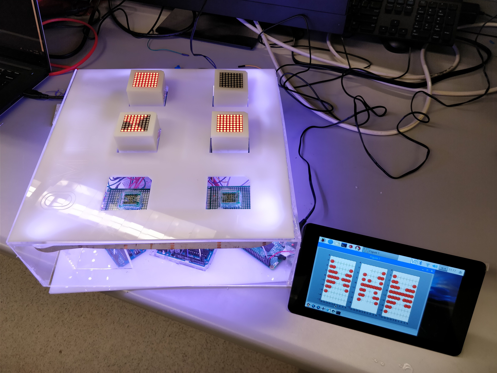

# Omega3

A real-time visualization of neural networks to uncover their inner workings and help educate people about machine learning.

See the full paper at https://ieeexplore.ieee.org/document/8882046

## Directory Structure

- `CAD files/`: the CAD files used in the fabrication of Omega3.
- `images/`: pictures taken during the construction of Omega3.
- `paper/`: files used to write the paper "Real-Time Visualization of Neural Network Training to Supplement Machine Learning Education"
- `src/`: source code for the project. Includes code for the Raspberry Pi and Arduino.
